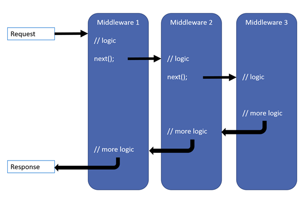

# Dotnet Deep Dive 

Contents:
- [Fundamentals](https://learn.microsoft.com/en-us/aspnet/core/fundamentals/?view=aspnetcore-8.0)
  - [App start up](#app-startup)
  - [Dependency Injection (Services)](#dependency-injection-services)
  - [Middleware](#middleware)
    - [Custom middleware example](#example-of-writing-a-custom-middleware)
  - [Host](#host)
  - [Servers](#servers)
  - [Configuration](#configuration)
  - Options
  - Environments
  - Logging and monitoring 
  - HttpContext
  - Routing
  - Handle errors
  - Make HTTP requests
  - Static Files 
- [APIs](https://learn.microsoft.com/en-us/aspnet/core/fundamentals/apis?view=aspnetcore-8.0) 
  - Controller-based APIs
  - Minimal APIs
- [Best practices](https://learn.microsoft.com/en-us/aspnet/core/fundamentals/best-practices?view=aspnetcore-8.0)
- [Servers](https://learn.microsoft.com/en-us/aspnet/core/fundamentals/servers/?view=aspnetcore-8.0&tabs=windows)
  - Kestrel 
  - IIS
- [Security and Identity](https://learn.microsoft.com/en-us/aspnet/core/security/?view=aspnetcore-8.0)
  - Authentication
  - Authorization
  - Data protection
  - Secrets Management
  - Enforce HTTPS
  - Host docker with HTTPs
  - Docker Compose with HTTPS
  - GDPR support 
  - Prevent XSRF / CSRF attacks 
  - Prevent open redirect attacks
  - Prevent XSS attacks 
  - Enable CORS requests
  - Share cookies among apps 
  - SameSite cookies
  - IP safelist 
  - OWASP 
- [Performance](https://learn.microsoft.com/en-us/aspnet/core/performance/overview?view=aspnetcore-8.0)
  - Caching 
  - Rate limiting middleware
  - Timeouts middleware
  - Memory and GC
  - Object reuse with ObjectPool
  - Response compression
  - Diagnostic tools
  - Load and stress testing 
  - Event counters 

---

## Fundamentals 

### App Startup 
- `Program.cs`
  - application startup code is in Program.cs file 
    - services required by the app are configured here
    - app's request handling pipeline is defined as a series of middleware components 
  - There are different ways to do this, probably depends on the type of Host used
  - Generally there will be a services registration area, i.e. `builder.services.AddSingleton<IOrganisationProvider, OrganisationProvider>();` and a middleware registration area that follows afterward, i.e. `app.UseAuthorization();`


### Dependency Injection (services)
  - dependency injection or DI makes configured services available throughout the app
  - it is a technique intended to achieve [inversion of control](https://learn.microsoft.com/en-us/dotnet/architecture/modern-web-apps-azure/architectural-principles#dependency-inversion)
    - direction of dependency in the direction of abstraction, not implementation details
    - allows for easier testing and means that different implementations of these interfaces can easily be plugged in without modifying the code (open-closed principle)
  - a depencency is an object that another object depends on
  - services are added to the DI container, i.e.:
````c#
var builder = WebApplication.CreateBuilder(args);

// Add services to the container.
builder.Services.AddRazorPages();
builder.Services.AddControllersWithViews();
builder.services.AddSingleton<IOrganisationProvider, OrganisationProvider>();

var app = builder.Build();
````
  - this uses the [builder pattern](https://refactoring.guru/design-patterns/builder)
  - services are typically resolved from DI using constructor injection. The DI framework provides an instance of this service at runtime can can be used as follows:
````c#
public class SomeClass 
{
  private readonly IOrganisationProvider _orgProvider
  public IList<Organisation> Organisation {get ; set;}

  public SomeClass(IOrganisationPrivider organisationProvider)
  {
    _orgProvider = organisationProvider
  }

  public async Task SetOrganisation()
  {
    Organisation = await _orgProvider.GetOrganisation("someId")
  }
}
````
- [Service lifetimes](https://learn.microsoft.com/en-us/dotnet/core/extensions/dependency-injection#service-lifetimes)
  - Services can be registered with one of the following lifetimes:
    - Transient
    - Scoped
    - Singleton
  - Transient:
    - created each time they're requested from the service container
  - Scoped:
    - A scoped lifetime indicates that services are created once per client request (connection)
  - Singleton
    - singleton lifetime services are created either:
      - the first time they're requested
      - by the developer, when providing an implementation instance directly to the container (an approach rarely needed)
    - every subsequent request of the service implementation from the DI container uses the same instance.
- Keyed Services
  - in dotnet 8 there is support for registrations of services based on a key, so you can register multiple services with a different key and use it for the lookup. i.e.:
````c#
services.AddKeyedSingleton<IMessageWriter, MemoryMessageWriter>("memory");
services.AddKeyedSingleton<IMessageWriter, QueueMessageWriter>("queue");

// example of the constructor of the class that uses IMessageWriter: 
public class ExampleService
{
    public ExampleService(
        [FromKeyedServices("queue")] IMessageWriter writer)
    {
        // Omitted for brevity...
    }
}
````


### Middleware 
  - The request handling pipeline is composed as a series of middleware components. Each component performs operations on an HttpContext and either invokes the next middleware in the pipeline or terminates the request. 
    - Each middleware is responsible for invoking the next component or short-circuiting the pipeline (i.e. terminating the request) - if it short-circuits, its called a terminal middleware because it prevents further middleware from processing the request.
  - Request delegates are used to build the request pipeline - they handle each HTTP request
    - Configured using `Run`, `Map` and `Use` extension methods
      - specified either as an in-line anonymous method (in-line middleware) or defined in a reusable class


  - each middleware delegate can perform operations before and after the next delegate - the order matters.
    - i.e. exception-handling delegates should be called early in the pipeline so they can catch exceptions that occur in later stages of the pipeline.
````c#
var builder = WebApplication.CreateBuilder(args);
var app = builder.Build();

// example of an "in-line anonymous middleware" 
app.Use(async (context, next) =>
{
    // Do work that can write to the Response => i.e. before the next delegate is called
    await next.Invoke(); // this calls the next delegate in the pipeline
    // Do logging or other work that doesn't write to the Response => i.e. after the above delegate is completed. 
});

app.Run(async context =>
{
    await context.Response.WriteAsync("Hello from 2nd delegate.");
});

app.Run();
````

- `Run` delegates don't receive a `next` parameter. The first `Run` delegate is always terminal and terminates the pipeline. `Run` is a convention. Some middleware 

  - Middle ware uses the [chain of responsibility pattern](https://refactoring.guru/design-patterns/chain-of-responsibility)
  - by convention, a middleware component is added to the pipeline by invoking a `Use{Feature}` extension method. I.e.:
````c#
var builder = WebApplication.CreateBuilder(args);

// Add services to the container.
builder.Services.AddControllersWithViews();

var app = builder.Build();

// Middleware below
if (!app.Environment.IsDevelopment())
{
    app.UseExceptionHandler("/Error");
    app.UseHsts();
}

app.UseHttpsRedirection();
app.UseStaticFiles();

app.UseAuthorization();
// middleware above

app.MapDefaultControllerRoute();

app.Run();
````

- Middleware order
  - the below diagram shows a request processing pipeline for a dotnet core MVC / razor page app. 
  - existing middlewares are ordered and custom middlewares are added

  

  - this is when explicitly calling app.UseRouting - if you don't call this, the routing middleware runs at the beginning of the pipeline by default.

  - some of the existing pre-built middleware must be called in certain order, see: https://learn.microsoft.com/en-us/aspnet/core/fundamentals/middleware/?view=aspnetcore-8.0
    - i.e. `UseCors` must be before `UseAuthentication` which must be before `UseAuthorisation` etc.


- Branch the middleware pipeline
  - `Map` extensions are used as a convention for branching the pipeline. Map branches the request pipeline based on the given request path. If the request path starts with the given path, the branch is executed. 
````c#
var builder = WebApplication.CreateBuilder(args);
var app = builder.Build();

app.Map("/map1", HandleMapTest1);

app.Map("/map2", HandleMapTest2);

app.Run(async context =>
{
    await context.Response.WriteAsync("Hello from non-Map delegate.");
});

app.Run();

static void HandleMapTest1(IApplicationBuilder app)
{
    app.Run(async context =>
    {
        await context.Response.WriteAsync("Map Test 1");
    });
}

static void HandleMapTest2(IApplicationBuilder app)
{
    app.Run(async context =>
    {
        await context.Response.WriteAsync("Map Test 2");
    });
}
````
- in the above code, going to 'localhost:1234' responds with "Hello from non-Map delegate"
- going to 'localhost:1234/map1' responds with "Map test 1" etc


- Built-in middleware: 
  - info here: https://learn.microsoft.com/en-us/aspnet/core/fundamentals/middleware/?view=aspnetcore-8.0#built-in-middleware

#### Example of writing a custom middleware
- https://learn.microsoft.com/en-us/aspnet/core/fundamentals/middleware/write?view=aspnetcore-8.0

---

### Host
  - On startup, a dotnet app builds a host. The host encapsulates all of the app's resources, such as:
    - A HTTP server implementation
    - Middleware components
    - Logging
    - DI services
    - Configuration
  - There are 3 different hosts capable of running a dotnet app:
    - ASP.NET Core WebApplication, also known as the Minimal Host 
    - .NET Generic Host combined with ASP.NET core's ConfigureWebHostDefaults
    - ASP.NET Core WebHost
  - `WebApplication` and `WebApplicationBuilder`are recommended and used in all dotnet core templates. 
  - `WebHost` is available only for backward compatibility. 
  - `WebApplication` / `WebApplicationBuilder` example: 
````c#
var builder = WebApplication.CreateBuilder(args); // => this is an instance of 'WebApplicationBuilder'.

// Use the builder to configure services
builder.Services.AddControllers();
builder.Services.AddScoped<ITodoRepository, TodoRepository>(); // => DI injection example.

var app = builder.Build(); // => this is an instance of 'WebApplication'.

// Use the app to configure middleware and endpoints
app.UseRouting();
app.UseEndpoints(endpoints =>
{
    endpoints.MapControllers();
});

// Run the application
app.Run();
````
  - The `WebApplicationBuilder` configures a host with a set of default options, such as:
    - Use Kestrel as the web server and enable IIS integration
    - Load configuration from appsettings.json, environment variables, command line arguments, and other config sources
    - Send logging output to the console and debug providers
  - The Generic Host allows other types of apps for non-web scenarios like cruss-cutting framework extensions


#### WepApplication Deep Dive

````c#
var builder = WebApplication.CreateBuilder(args);
var app = builder.Build();

app.MapGet("/", () => "Hello World!");

app.Run();
````
- can also use this - `WebApplication.Create` initializes a new instance of WebApplication with preconfigured defaults:

````c#
var app = WebApplication.Create(args);

app.MapGet("/", () => "Hello World!");

app.Run();
````

- Working with Ports
  - when a web app is created with visual studio or `dotnet new`, a properties/launchSettings.json file is created that specifies the ports the app responds to
  - you can also set the port in the startup.cs, including multiple ports:

````c#
var app = WebApplication.Create(args);

app.Urls.Add("http://localhost:3000");
app.Urls.Add("http://localhost:4000");

app.MapGet("/", () => "Hello World");

app.Run();
````

  - You can also set the port from the command line: `dotnet run --urls="https://localhost:7777"`
  - You can also read the port from the environment:
    - the preferred way being setting the ASPNETCORE_URLS environment variable, i.e. `ASPNETCORE_URLS=http://localhost:3000`
    - or for multiple ports, `ASPNETCORE_URLS=http://localhost:3000;https://localhost:5000`

````c#
var app = WebApplication.Create(args);

var port = Environment.GetEnvironmentVariable("PORT") ?? "3000";

app.MapGet("/", () => "Hello World");

app.Run($"http://localhost:{port}");
````

- Read the environment example

````c#
var app = WebApplication.Create(args);

if (!app.Environment.IsDevelopment())
{
    app.UseExceptionHandler("/oops");
}

app.MapGet("/", () => "Hello World");
app.MapGet("/oops", () => "Oops! An error happened.");

app.Run();
````

- Read the configuration system: (appSettings.json)

````c#
var app = WebApplication.Create(args);

var message = app.Configuration["HelloKey"] ?? "Config failed!";

app.MapGet("/", () => message);

app.Run();
````

- Access the DI container to add custom services 
- Add middleware 

````c#
var builder = WebApplication.CreateBuilder(args);

// Add a custom scoped service.
builder.Services.AddScoped<ITodoRepository, TodoRepository>(); // NOTE: done before builder.Build() is called, then middleware added to app
var app = builder.Build();
app.UseFileServer(); // add middleware

app.Run()
````

---


### Servers
  - dotnet core apps use a HTTP server implementation to listen for HTTP request. The server surfaces requests to the app as a set of request features composed into a HttpContext 
  - Kestrel is a cross-platform web server, it runs on windows / mac / linux. 
  - IIS and HTTP.sys are for windows only. 

---

### Configuration
  - dotnet provides a configuration framework that gets settings as name-value pairs from an ordered set of configuration providers. Built-in config providers are available as .json or .xml files, environment variables, and command-line arguments.
  - by default they're read from `appsettings.json`, environment variables and command line arguments
  - when the apps config is loaded, values from environment variables override values from `appsettings.json`

---

- Environments
  - Execution environments such as Development, Staging and Production are available in dotnet core. Specify the environment an app is running in by setting the `ASPNETCORE_ENVIRONMENT` environment variable. It gets read at startup and stores the value in `IWebHostEnvironment` implementation.
    - `IWebHostEnvironment` is available anywhere in the app via dependency injection. 

- Logging 
  - dotnet supports a logging API that works with a variety of built-in and third-party logging providers. Available providers include:
    - Console
    - Debug
    - Event Tracing on Windows
    - Windows Event Log 
    - TraceSource
  - to create logs, resolve an `ILogger<TCategoryName>` service from DI and call logging methods such as `LogInformation`, i.e.:
````c#
public class IndexModel : PageModel
{
    private readonly RazorPagesMovieContext _context;
    private readonly ILogger<IndexModel> _logger;

    public IndexModel(RazorPagesMovieContext context, ILogger<IndexModel> logger)
    {
        _context = context;
        _logger = logger;
    }

    public IList<Movie> Movie { get;set; }

    public async Task OnGetAsync()
    {
        _logger.LogInformation("IndexModel OnGetAsync.");
        Movie = await _context.Movie.ToListAsync();
    }
}
````

- Routing 
  - A Route is a URL pattern mapped to a handler. The handler is typically a controller or a middleware. Dotnet routing gives you control over the URLs used by your app. 

- Make HTTP Requests
  - An implementation of `IHttpClientFactory` is available for creating `HttpClient` instances. The factory:
    - Provides a central location for naming and configuring logical `HttpClient` instances. I.e., register and configure a github client for accessing Github.
    - Supports registration and chaining of multiple delegating handlers to buuld an outgoing request middleware pipeline. This pattern is similar to dotnet's inbound middleware pipeline. It provides a mechanism to manage cross-cutting concerns for HTTP requests including caching, error handling, serialization, and logging. 
    - Integrates with Polly - for transient fault handling. (circuit breaker)
    - Manages the pooling and lifetime of underlying `HttpClientHandler` instances to avoid common DNS problems that occur when managing `HttpClient` lifetimes manually. 
    - Adds a configurable logging experience via ILogger for all requests sent through clients created by the factory. 


  /// note: up to configuration: https://learn.microsoft.com/en-us/aspnet/core/fundamentals/configuration/?view=aspnetcore-8.0